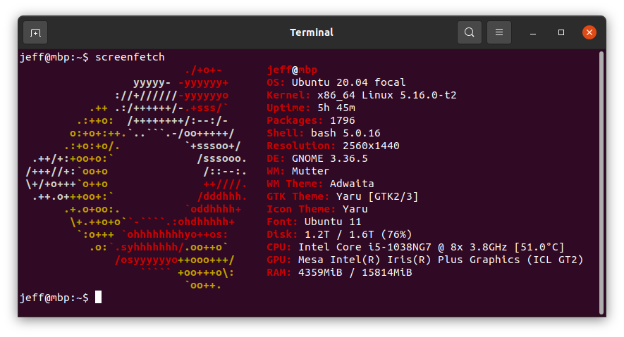

## Install Ubuntu 20.04 on MacBook Pro 16,2 with Broadcom 4364 Chipset

My objective is simple: install Ubuntu 20.04 on MacBook 16,2. It's known this model has T2 security chip. I tried many methods to enable Broadcom 4364 for wireless, including instruction from https://wiki.t2linux.org/guides/wifi/, but no luck.

Here's my hardware

```sh
jeff@mbp:~$ lspci -vvnn | grep -i network
e5:00.0 Network controller [0280]: Broadcom Inc. and subsidiaries BCM4364 802.11ac
    Wireless Network Adapter [14e4:4464] (rev 04)
    Subsystem: Apple Inc. BCM4364 802.11ac Wireless Network Adapter [106b:07bf]
jeff@mbp:~$
```

Manually placed Broadcom firmware. __Make sure you backup `/lib/firmwire/brcm`__ if existing

```sh
## Backup `/lib/firmware/brcm` if existing
wget https://github.com/j3ffyang/mbp-ubuntu/blob/master/files/brcm.tar.gz
cd /lib/firmware/; sudo tar -xzvf brcm.tar.gz
```



The kernel running when writing this document

```sh
Linux mbp 5.16.0-t2 #2 SMP PREEMPT Wed Jan 12 11:25:28 UTC 2022 x86_64 x86_64 x86_64 GNU/Linux
```

By the way, some additional information

```sh
jeff@mbp:~$ sudo dmesg | grep brcmfmac
[sudo] password for jeff:
[    2.822826] usbcore: registered new interface driver brcmfmac
[    2.823287] brcmfmac 0000:e5:00.0: enabling device (0000 -> 0002)
[    2.930922] brcmfmac: brcmf_fw_alloc_request: using brcm/brcmfmac4364b3-pcie for chip BCM4364/4
[    2.931972] brcmfmac 0000:e5:00.0: Direct firmware load for brcm/brcmfmac4364b3-pcie.apple,trinidad-HRPN-u-7.7-X3.bin failed with error -2
[    2.932242] brcmfmac 0000:e5:00.0: Direct firmware load for brcm/brcmfmac4364b3-pcie.apple,trinidad-HRPN-u-7.7.bin failed with error -2
[    2.932289] brcmfmac 0000:e5:00.0: Direct firmware load for brcm/brcmfmac4364b3-pcie.apple,trinidad-HRPN-u.bin failed with error -2
[    2.932308] brcmfmac 0000:e5:00.0: Direct firmware load for brcm/brcmfmac4364b3-pcie.apple,trinidad-HRPN.bin failed with error -2
[    2.932324] brcmfmac 0000:e5:00.0: Direct firmware load for brcm/brcmfmac4364b3-pcie.apple,trinidad-X3.bin failed with error -2
[    3.201139] Modules linked in: md4 snd_sof_intel_hda acpi_cpufreq(-) algif_hash snd_sof_pci coretemp af_alg snd_sof_xtensa_dsp snd_sof i915(+) kvm_intel snd_hda_ext_core snd_soc_acpi_intel_match snd_soc_acpi soundwire_bus ledtrig_audio kvm snd_soc_core irqbypass crct10dif_pclmul hci_uart ghash_clmulni_intel aesni_intel brcmfmac btqca pkcs8_key_parser i2c_algo_bit btrtl brcmutil crypto_simd snd_compress cryptd nls_iso8859_1 ttm msr btbcm ac97_bus rapl nls_cp437 btintel snd_pcm_dmaengine parport_pc intel_cstate vfat ppdev cfg80211 fat drm_kms_helper snd_hda_intel intel_uncore bluetooth lp snd_intel_dspcfg parport snd_intel_sdw_acpi processor_thermal_device_pci_legacy cec snd_hda_codec processor_thermal_device apple_ib_als(OE) processor_thermal_rfim industrialio_triggered_buffer mmc_core rc_core kfifo_buf processor_thermal_mbox processor_thermal_rapl industrialio intel_gtt ax88179_178a(+) mei_me agpgart snd_hda_core ecdh_generic intel_rapl_common usbnet syscopyarea apple_ib_tb(OE)
[    3.736935] brcmfmac: brcmf_c_process_txcap_blob: TxCap blob found, loading
[    3.738712] brcmfmac: brcmf_c_preinit_dcmds: Firmware: BCM4364/4 wl0: Jul 12 2021 18:02:56 version 9.30.464.0.32.5.76 FWID 01-c081cfed
```

```sh
journalctl | grep brcmfmac

Jan 17 13:43:03 mbp kernel: brcmfmac: brcmf_c_process_txcap_blob: TxCap blob found, loading
Jan 17 13:43:03 mbp kernel: brcmfmac: brcmf_c_preinit_dcmds: Firmware: BCM4364/4 wl0: Jul 12 2021 18:02:56 version 9.30.464.0.32.5.76 FWID 01-c081cfed
Jan 17 13:43:03 mbp NetworkManager[500]: <info>  [1642398183.8747] rfkill1: found Wi-Fi radio killswitch (at /sys/devices/pci0000:00/0000:00:1c.0/0000:e5:00.0/ieee80211/phy0/rfkill1) (driver brcmfmac)
Jan 17 19:34:59 mbp kernel: usbcore: registered new interface driver brcmfmac
Jan 17 19:34:59 mbp kernel: brcmfmac 0000:e5:00.0: enabling device (0000 -> 0002)
Jan 17 19:34:59 mbp kernel: brcmfmac: brcmf_fw_alloc_request: using brcm/brcmfmac4364b3-pcie for chip BCM4364/4
Jan 17 19:34:59 mbp kernel: brcmfmac 0000:e5:00.0: Direct firmware load for brcm/brcmfmac4364b3-pcie.apple,trinidad-HRPN-u-7.7-X3.bin failed with error -2
Jan 17 19:34:59 mbp kernel: brcmfmac 0000:e5:00.0: Direct firmware load for brcm/brcmfmac4364b3-pcie.apple,trinidad-HRPN-u-7.7.bin failed with error -2
Jan 17 19:34:59 mbp kernel: brcmfmac 0000:e5:00.0: Direct firmware load for brcm/brcmfmac4364b3-pcie.apple,trinidad-HRPN-u.bin failed with error -2
Jan 17 19:34:59 mbp kernel: brcmfmac 0000:e5:00.0: Direct firmware load for brcm/brcmfmac4364b3-pcie.apple,trinidad-HRPN.bin failed with error -2
Jan 17 19:34:59 mbp kernel: brcmfmac 0000:e5:00.0: Direct firmware load for brcm/brcmfmac4364b3-pcie.apple,trinidad-X3.bin failed with error -2
Jan 17 19:34:59 mbp kernel: Modules linked in: md4 snd_sof_intel_hda acpi_cpufreq(-) algif_hash snd_sof_pci coretemp af_alg snd_sof_xtensa_dsp snd_sof i915(+) kvm_intel snd_hda_ext_core snd_soc_acpi_intel_match snd_soc_acpi soundwire_bus ledtrig_audio kvm snd_soc_core irqbypass crct10dif_pclmul hci_uart ghash_clmulni_intel aesni_intel brcmfmac btqca pkcs8_key_parser i2c_algo_bit btrtl brcmutil crypto_simd snd_compress cryptd nls_iso8859_1 ttm msr btbcm ac97_bus rapl nls_cp437 btintel snd_pcm_dmaengine parport_pc intel_cstate vfat ppdev cfg80211 fat drm_kms_helper snd_hda_intel intel_uncore bluetooth lp snd_intel_dspcfg parport snd_intel_sdw_acpi processor_thermal_device_pci_legacy cec snd_hda_codec processor_thermal_device apple_ib_als(OE) processor_thermal_rfim industrialio_triggered_buffer mmc_core rc_core kfifo_buf processor_thermal_mbox processor_thermal_rapl industrialio intel_gtt ax88179_178a(+) mei_me agpgart snd_hda_core ecdh_generic intel_rapl_common usbnet syscopyarea apple_ib_tb(OE)
Jan 17 19:35:00 mbp kernel: brcmfmac: brcmf_c_process_txcap_blob: TxCap blob found, loading
Jan 17 19:35:00 mbp kernel: brcmfmac: brcmf_c_preinit_dcmds: Firmware: BCM4364/4 wl0: Jul 12 2021 18:02:56 version 9.30.464.0.32.5.76 FWID 01-c081cfed
Jan 17 19:35:01 mbp NetworkManager[802]: <info>  [1642419301.1008] rfkill1: found Wi-Fi radio killswitch (at /sys/devices/pci0000:00/0000:00:1c.0/0000:e5:00.0/ieee80211/phy0/rfkill1) (driver brcmfmac)
```

Reference
- https://github.com/marcosfad/mbp-ubuntu
- https://github.com/AdityaGarg8/T2-Ubuntu-Kernel/
- https://github.com/aunali1/linux-mbp-arch
